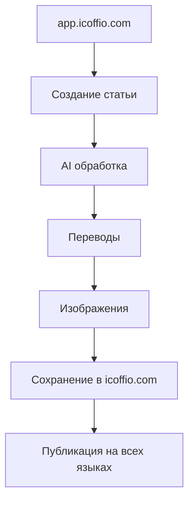

# 🚀 Развертывание админ панели на app.icoffio.com

## 📋 ОБЗОР

Создаем отдельную админ панель на поддомене `app.icoffio.com` для управления контентом основного сайта `icoffio.com`.

### 🌐 АРХИТЕКТУРА

```
icoffio.com          - Основной сайт (только чтение)
└── Статьи, категории, навигация

app.icoffio.com      - Админ панель (управление)  
├── /admin           - Главная админ панель
├── /admin/add-article - Создание статей
├── /api/articles    - Единый API управления
├── /api/generate-article - Старый API (совместимость)
└── /api/n8n-webhook - N8N интеграция
```

---

## 🛠 НАСТРОЙКА РАЗВЕРТЫВАНИЯ

### 1. Vercel конфигурация для app.icoffio.com

Создайте новый проект в Vercel:

```bash
# Клонируйте репозиторий для админки
vercel --name app-icoffio-admin

# Настройте домен
vercel domains add app.icoffio.com
vercel domains link app.icoffio.com app-icoffio-admin
```

### 2. Переменные окружения для app.icoffio.com

В Vercel Dashboard > Settings > Environment Variables:

```env
# Режим админки
NEXT_PUBLIC_ADMIN_MODE=true
ADMIN_MODE=true

# API конфигурация  
NEXT_PUBLIC_SITE_URL=https://app.icoffio.com
NEXT_PUBLIC_MAIN_SITE_URL=https://icoffio.com
NEXT_PUBLIC_WP_ENDPOINT=https://icoffio.com/graphql

# Админ панель
NEXT_PUBLIC_ADMIN_PASSWORD=your-secure-password

# OpenAI API
OPENAI_API_KEY=sk-your-openai-key

# Unsplash API  
UNSPLASH_ACCESS_KEY=your-unsplash-key

# WordPress интеграция
WORDPRESS_API_URL=https://icoffio.com
WORDPRESS_USERNAME=your-wp-user  
WORDPRESS_APP_PASSWORD=your-wp-app-password

# N8N безопасность
N8N_WEBHOOK_SECRET=your-webhook-secret

# Окружение
NODE_ENV=production
```

### 3. Build конфигурация

В `vercel.json` для админ проекта:

```json
{
  "buildCommand": "npm run admin:build",
  "devCommand": "npm run admin:dev",
  "framework": "nextjs",
  "functions": {
    "app/api/**/*.ts": {
      "maxDuration": 30
    }
  },
  "headers": [
    {
      "source": "/(.*)",
      "headers": [
        {
          "key": "X-Robots-Tag",
          "value": "noindex, nofollow"
        },
        {
          "key": "X-Frame-Options", 
          "value": "DENY"
        }
      ]
    }
  ],
  "redirects": [
    {
      "source": "/",
      "destination": "/ru/admin",
      "permanent": false
    }
  ],
  "rewrites": [
    {
      "source": "/api/(.*)",
      "destination": "/api/$1"
    }
  ]
}
```

---

## 🔧 ЛОКАЛЬНАЯ РАЗРАБОТКА

### Запуск админ панели локально

```bash
# Основной сайт (порт 3000)
npm run dev

# Админ панель (порт 3001)  
npm run admin:dev
```

### Тестирование API

```bash
# Тест создания статьи
curl -X POST http://localhost:3001/api/generate-article \
  -H "Content-Type: application/json" \
  -d '{
    "title": "Тестовая статья",
    "content": "Содержимое тестовой статьи...",
    "category": "tech"
  }'

# Тест N8N webhook
curl -X POST http://localhost:3001/api/articles \
  -H "Content-Type: application/json" \
  -H "Authorization: Bearer your-secret" \
  -d '{
    "action": "create-from-telegram",
    "data": {
      "title": "Статья из телеграма",
      "content": "Текст сообщения..."
    }
  }'
```

---

## 🌍 ДОСТУП К АДМИН ПАНЕЛИ

### URL структура

- **Главная админ панель:** `https://app.icoffio.com/ru/admin`
- **Создание статей:** `https://app.icoffio.com/ru/admin/add-article`  
- **API документация:** `https://app.icoffio.com/api/articles`
- **Старый API:** `https://app.icoffio.com/api/generate-article`

### Аутентификация

1. Откройте `https://app.icoffio.com/ru/admin`
2. Введите пароль администратора
3. Получите доступ ко всем функциям

### Доступные функции

✅ **Создание статей** - из URL и текста  
✅ **Автоматические переводы** - на 5 языков  
✅ **ИИ копирайтинг** - улучшение контента  
✅ **Генерация изображений** - DALL-E + Unsplash  
✅ **N8N интеграция** - телеграм бот  
✅ **Мониторинг** - состояние сервисов  

---

## 🔄 ИНТЕГРАЦИЯ С ОСНОВНЫМ САЙТОМ

### Workflow создания статей



### N8N интеграция

Обновите webhook URL в N8N:

```
Старый: https://icoffio.com/api/n8n-webhook
Новый:  https://app.icoffio.com/api/articles
```

### API совместимость

Все старые API endpoints работают для обратной совместимости:

- `/api/generate-article` ✅
- `/api/n8n-webhook` ✅  
- `/api/translate` ✅
- `/api/articles` ✅ (новый)

---

## 🔒 БЕЗОПАСНОСТЬ

### Настройки домена

```
app.icoffio.com:
- Robots: noindex, nofollow
- X-Frame-Options: DENY  
- Аутентификация обязательна
- HTTPS только

icoffio.com:
- Публичный доступ
- SEO индексация
- Кеширование CDN
```

### Права доступа

- **Администраторы:** Полный доступ к app.icoffio.com
- **Пользователи:** Только чтение icoffio.com  
- **Боты:** API доступ через токены

---

## 📊 МОНИТОРИНГ И АНАЛИТИКА

### Health Check

```bash
curl https://app.icoffio.com/api/articles?action=health-check
```

### Логирование

Все действия в админ панели логируются:
- Создание статей
- API вызовы  
- Ошибки системы
- Использование ресурсов

### Метрики

- Количество статей в день
- Время обработки AI
- Использование API ключей
- Статистика переводов

---

## 🚀 РАЗВЕРТЫВАНИЕ

### Шаг 1: Подготовка кода

```bash
# Создайте отдельную ветку для админки
git checkout -b admin-app
git push origin admin-app
```

### Шаг 2: Настройка Vercel

1. Создайте новый проект в Vercel
2. Подключите ветку `admin-app`  
3. Настройте домен `app.icoffio.com`
4. Добавьте переменные окружения

### Шаг 3: Настройка DNS

```
app.icoffio.com    CNAME    cname.vercel-dns.com
```

### Шаг 4: Тестирование

1. Проверьте доступность `https://app.icoffio.com`
2. Протестируйте аутентификацию
3. Создайте тестовую статью
4. Проверьте интеграцию с основным сайтом

### Шаг 5: N8N обновление

Обновите все webhook URL в n8n с:
```
https://icoffio.com/api/n8n-webhook
```
На:
```  
https://app.icoffio.com/api/articles
```

---

## 🆘 TROUBLESHOOTING

### Админ панель не загружается

```bash
# Проверьте переменные окружения
curl https://app.icoffio.com/api/articles?action=health-check

# Проверьте аутентификацию
# Пароль: NEXT_PUBLIC_ADMIN_PASSWORD
```

### API не работает

```bash
# Проверьте CORS и домены
curl -H "Origin: https://app.icoffio.com" \
     https://app.icoffio.com/api/generate-article

# Проверьте токены авторизации
```

### N8N webhook ошибки

```bash
# Проверьте новый URL
curl -X POST https://app.icoffio.com/api/articles \
  -H "Authorization: Bearer ${N8N_WEBHOOK_SECRET}" \
  -d '{"action": "health-check"}'
```

---

## 🎉 ЗАКЛЮЧЕНИЕ

После развертывания у вас будет:

✅ **app.icoffio.com** - Полнофункциональная админ панель  
✅ **icoffio.com** - Основной сайт без админ функций  
✅ **Разделенная архитектура** - Безопасность и масштабируемость  
✅ **API совместимость** - Все старые интеграции работают  
✅ **N8N интеграция** - Телеграм бот автоматически создает статьи  

**Система готова к продакшену!** 🚀

---

*Документация создана: 2 сентября 2025*  
*Версия: 2.0.0*  
*Автор: AI Assistant для icoffio.com*

